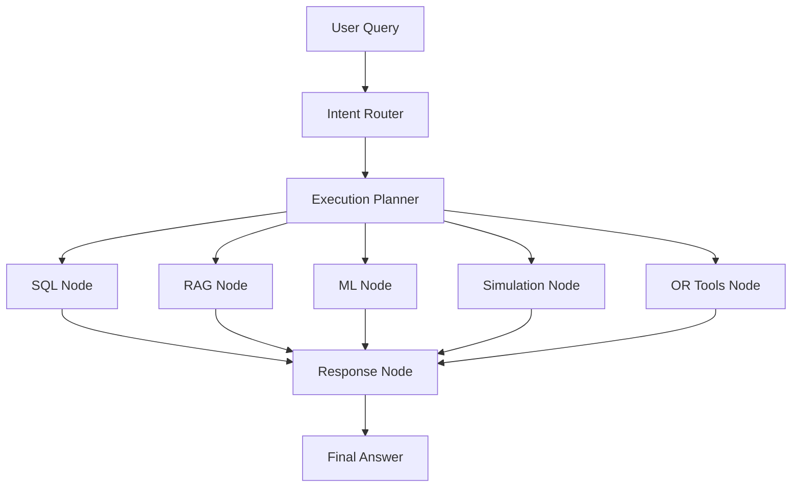
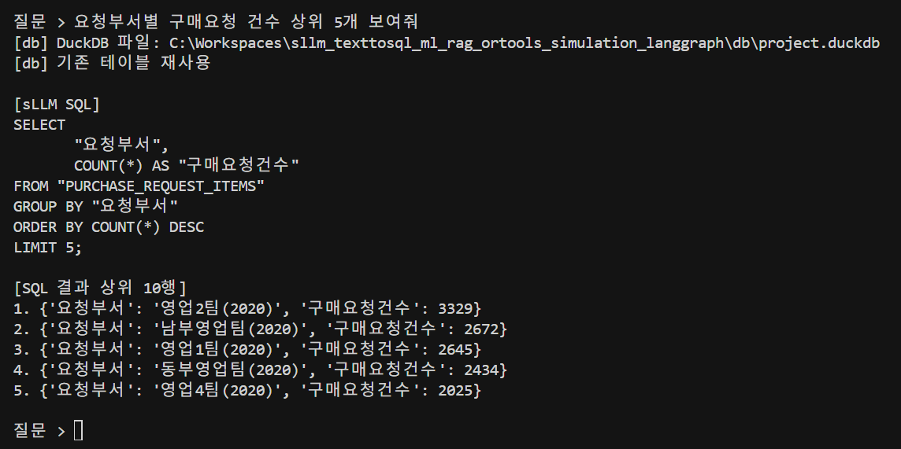
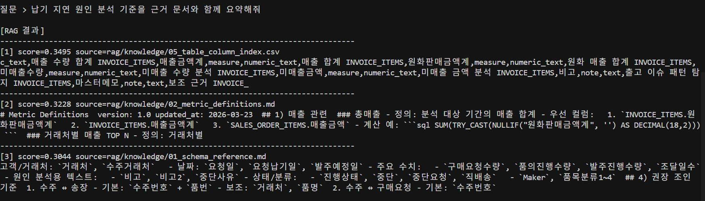
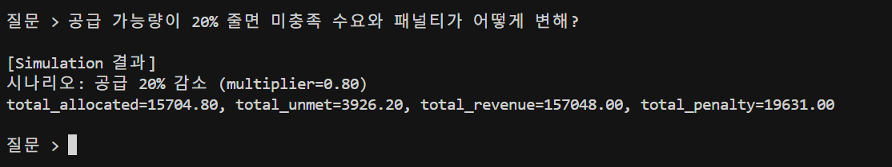
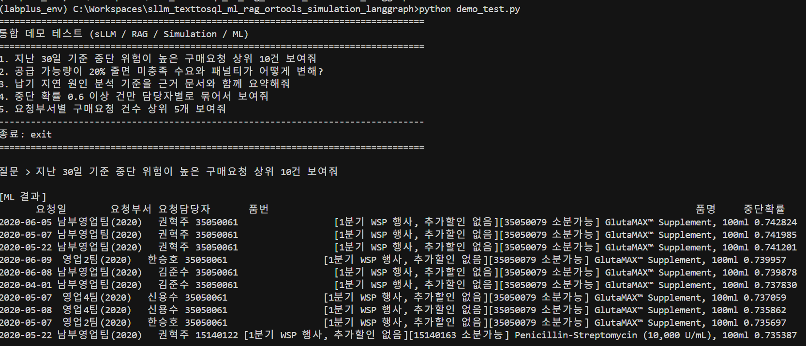
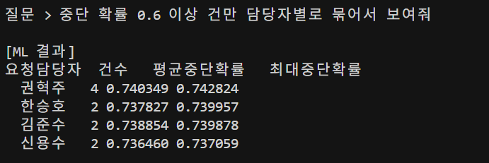
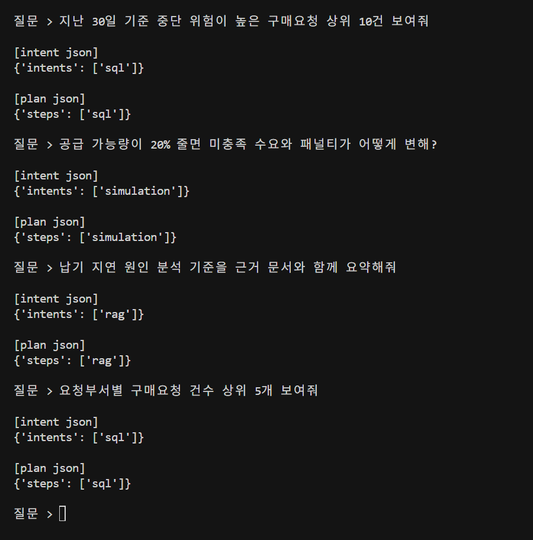

# Operations Decision Pipeline

자연어 질의를 sLLM/RAG/최적화/시뮬레이션/ML로 연결해 운영 의사결정을 지원하는 프로젝트입니다.

본 문서는 저장소의 기술 구성, 모듈 간 책임, 데이터·모델·외부 API 의존 관계, 그리고 재현·운영 시 유의사항을 **대외 제출·내부 검토·이관(Handover)** 관점에서 서술합니다. 다이어그램과 디렉터리 트리는 구조를 한눈에 보여 주고, 이어지는 장문 설명은 각 구성 요소가 **어떤 입력을 받아 어떤 산출물을 만들며, 어디서 실패할 수 있는지**를 분리하여 기술합니다. 요약만으로는 부족한 맥락은 「배경 및 문서 목적」「가정·한계 및 리스크」「운영·거버넌스 권고」에서 보완합니다.

---

## 배경 및 문서 목적

운영 조직에서의 의사결정은 단일 숫자나 단일 보고서로 완결되지 않습니다. 현황 조회(거래·수주·구매 등), 정책·정의에 대한 근거 확보, 제약 하에서의 자원 배분, 가정 변경에 따른 시나리오 비교, 그리고 사전 경보에 가까운 위험 스코어링이 **동시에** 요구되는 경우가 많습니다. 본 프로젝트는 이러한 요구를 **하나의 질의 파이프라인**으로 묶되, 각 단계는 **독립 모듈**로 유지하여 변경·검증·감사 추적이 가능하도록 설계되었습니다.

문서 목적은 다음과 같습니다. 첫째, 검토자가 코드를 열지 않고도 **기능 경계와 책임 소재**를 파악할 수 있게 할 것. 둘째, 재현을 위해 필요한 **환경 변수, 데이터 경로, 스크립트 엔트리**를 한곳에 정리할 것. 셋째, LLM·임베딩·최적화 등 **불확실성이 큰 구간**을 명시하여 과도한 신뢰를 방지할 것.

---

## 개요

파이프라인의 중심은 **사용자 질의 한 문장**입니다. 질의는 먼저 의도 분류(Router)와 실행 계획(Planner)을 거쳐, 필요한 하위 엔진(SQL, RAG, ML, Simulation, OR-Tools)만 순서대로 호출됩니다. 각 엔진의 결과는 Response 단계에서 **통합 payload**로 묶인 뒤, 자연어 최종 응답으로 정리됩니다. 이 구조는 “모든 질문에 모든 엔진을 돌리는” 비효율을 줄이고, 장애 시에도 **부분 결과와 오류 맥락**을 남기기 쉽습니다.

---

## 프로젝트 범위

아래 항목은 본 저장소가 **명시적으로 다루는 기능 범위**입니다. 범위 밖(예: 운영 DB에 대한 직접 연동, 인증·권한 서버, 실시간 스트리밍 UI 등)은 별도 시스템으로 가정합니다.

- 질의를 SQL로 변환해 운영 데이터를 조회(sLLM)
- RAG로 정책/코드북 근거 검색
- OR-Tools/Simulation으로 시나리오 계산
- ML 모델로 구매요청 중단 위험 스코어링
- Router + Planner로 노드 실행을 오케스트레이션

범위를 넓게 보면, **“질의 → 구조화된 실행 → 해석 가능한 산출”**의 전 구간을 포괄합니다. 좁게 보면, 각 블록은 개별 스크립트·노트북·서비스 레이어로 분리되어 있어 **단위 검증**이 가능합니다.

---

## 의사결정 지원 관점에서의 가치

- **설명 가능성**: RAG는 수치·요약 문장에 **문서 출처**를 붙일 수 있습니다. SQL 경로는 **실행된 쿼리와 정규화 결과**를 함께 남깁니다.
- **정량 시나리오**: Simulation/OR-Tools는 동일한 입력 가정 하에서 **KPI를 재계산**하여 “만약 공급이 줄면?”과 같은 질문에 응답합니다.
- **사전 대응**: ML은 라인 단위 **중단 확률**을 산출하여 검토 우선순위를 두는 데 활용할 수 있습니다.
- **통제 가능한 자동화**: Router/Planner의 JSON 출력에 **스키마 검증**을 두어, 잘못된 계획이 하위 엔진으로 그대로 전달되는 것을 완화합니다.

위 가치는 **모델·데이터 품질·운영 정책**이 뒷받침될 때 성립합니다. 한계는 후반부 「가정, 한계 및 리스크」를 참고합니다.

---

## 파이프라인

아래 다이어그램은 **논리적 실행 순서**를 나타냅니다. 실제로는 Planner가 반환한 `steps`에 포함된 노드만 실행되며, Response는 실행된 노드의 결과만 취합합니다.



**정성적 흐름**: 사용자 질의는 Router에서 **어떤 의도(sql/rag/ml/simulation/or_tools 등)가 활성화되는지**를 구조화하고, Planner는 이를 **실행 순서**로 치환합니다. LangGraph 쪽 그래프는 해당 순서에 따라 노드를 호출하고, 각 노드는 서비스 레이어(`back/app/langgraph/services/`)를 통해 DuckDB·FAISS·joblib 모델·시뮬레이터·솔버에 도달합니다. 마지막에 Response 서비스가 Azure OpenAI 채팅 모델을 사용해 **한국어 최종 문장**을 생성합니다.

---

## 핵심 구성

### 1) sLLM (질의 -> SQL)

운영 현장의 질문은 대개 자연어로 제시됩니다. SQL 경로는 이를 **실행 가능한 질의**로 바꾸고, 로컬 분석용 DB인 DuckDB에서 수행해 **표 형태 결과**를 얻는 흐름을 담당합니다. Text-to-SQL은 모델·스키마 설명·예시 품질에 민감하므로, 본 저장소는 **생성 SQL과 정규화 SQL을 모두 보존**하여 사후 진단이 가능하게 합니다.

통합 그래프의 SQL 노드(`back/app/langgraph/services/sql_service.py`)는 `test/sllm_test.py`의 `ask_sllm`을 호출합니다. 해당 구현은 기본적으로 **로컬 Ollama** HTTP API(`http://127.0.0.1:11434/api/generate`, 모델명 `text2sql-sllm`)를 사용합니다. 따라서 데모·통합 경로를 재현하려면 Ollama 서버와 모델 가용성을 전제로 해야 합니다. `test/sllm_test.py`는 동일 경로를 **단독 대화형**으로 검증할 때 사용합니다.

- 역할
  - 자연어 질문을 SQL로 변환
  - DuckDB 실행 가능 형태로 정규화
- 핵심 파일
  - `test/sllm_test.py` (Ollama 연동 및 단독 테스트)
  - `back/app/langgraph/services/sql_service.py` (그래프 SQL 노드에서 정규화·실행까지 연결)
  - `back/app/db/sql_normalizer.py`
  - `back/app/db/duckdb_client.py`
- 출력
  - 생성 SQL
  - 정규화 SQL
  - 쿼리 결과 row set
- 세부 동작
  - 질문 문자열을 LLM에 전달해 SQL 초안 생성
  - DB 벤더 차이를 흡수하도록 SQL 정규화(`TOP -> LIMIT`, 함수 치환 등)
  - DuckDB에서 실행하고 상위 결과를 dict 리스트로 반환
- 주의 포인트
  - 모델이 잘못된 컬럼명을 생성하면 실행 에러가 발생할 수 있음
  - 정규화 규칙이 커버하지 못하는 SQL 문법은 수동 보완 필요
- 운영·감사 관점
  - 운영 반영 시에는 **쿼리 화이트리스트**, **읽기 전용 연결**, **행 수·시간 제한** 등을 별도 계층에서 두는 것이 바람직합니다. 본 저장소는 재현·프로토타입에 가깝게 DuckDB·로컬 Ollama를 사용합니다.

### 2) RAG (근거 검색)

RAG는 “왜 이렇게 정의했는가?”, “어떤 정책 문구가 근거인가?”와 같이 **문서 기반 설명**이 필요한 질문에 대응합니다. 임베딩 공간에서의 유사도 검색은 **키워드 일치**와 다른 패턴을 보이므로, 코드북·내부 가이드처럼 **문장 단위 지식**이 많은 자료에 적합합니다.

인덱스는 오프라인으로 구축(`back/app/rag/index_builder.py`)하고, 런타임에는 질의 임베딩 후 FAISS에서 top-k를 조회(`back/app/rag/retriever.py`)합니다. 문서 원본은 `back/app/rag/knowledge/`에 두며, 내용이 바뀌면 **재임베딩·재인덱싱**이 필요합니다.

- 역할
  - 질문 의미와 유사한 운영 문서를 벡터 검색으로 추출
  - 수치 결과에 정책/정의 근거를 연결
- 핵심 파일
  - `back/app/rag/index_builder.py` (문서 청크 + 임베딩 + FAISS 인덱스 생성)
  - `back/app/rag/retriever.py` (질문 임베딩 + top-k 검색)
  - `back/app/rag/knowledge/*` (근거 문서)
- 출력
  - `source`, `score`, `content` 기반 근거 리스트
- 세부 동작
  - 문서를 청크 단위로 분할해 임베딩 벡터 생성
  - FAISS index에서 질문 벡터와 유사도 검색(top-k)
  - 검색 결과를 source/score와 함께 반환
- 의존 설정
  - 임베딩 호출은 `OPENAI_API_KEY`, `OPENAI_EMBEDDING_MODEL` 사용
  - 문서 변경 시 인덱스 재생성 필요
- 운영·감사 관점
  - 검색 점수 임계값, 청크 크기, 메타데이터(버전, 시행일)를 로그에 남기면 **근거 추적성**이 높아집니다. Azure가 아닌 OpenAI API를 임베딩에 사용하는 현재 분리는 **라우팅/응답( Azure )** 과 **임베딩( OpenAI )** 의 키 관리를 이중으로 요구합니다.

### 3) ML (중단 위험 예측)

구매 요청 라인이 실제로 중단될지 여부는 운영적으로 **조기에 식별**할 가치가 있습니다. 본 모듈은 과거 라벨(중단 여부)을 바탕으로 학습된 **Random Forest 분류기**를 joblib 아티팩트로 적재하고, 추론 시 라인별 **중단 확률**을 산출합니다. 노트북 기반 EDA·학습 파이프라인은 재현과 모델 갱신 절차를 문서화하는 용도로 함께 제공됩니다.

서비스 레이어(`back/app/langgraph/services/ml_service.py`)는 질의 문맥에 따라 Top-N 나열과 임계값 필터, 담당자별 집계 등 **출력 형태를 전환**할 수 있도록 구성되어 있습니다. 평가 시에는 누수 컬럼 제외·시간 분할·불균형 지표 등을 노트북에서 점검하는 것이 전제입니다.

- 역할
  - 구매요청 라인별 `중단(0/1)` 위험 스코어 계산
  - 상위 위험 건, 담당자별 집계 제공
- 핵심 파일
  - `back/app/modellearn/eda.ipynb`
  - `back/app/modellearn/modellearn.ipynb`
  - `back/app/modellearn/artifacts/stop_classifier_rf.joblib`
  - `back/app/langgraph/services/ml_service.py`
- 검증 포인트
  - 누수 컬럼 제외
  - 시간 분할 평가
  - 클래스 불균형 지표(`precision/recall/f1`, `PR-AUC`)
- 세부 동작
  - 라인 단위 데이터에 대해 `predict_proba`로 중단 확률 계산
  - Top-N 출력과 임계값 필터링 출력 모두 지원
  - 요청에 `담당자별` 키워드가 있으면 담당자 집계로 자동 전환
- 산출 활용
  - 우선 검토 대상 큐 생성
  - 담당자별 위험 집중도 모니터링
- 운영·감사 관점
  - 확률은 **의사결정을 대체하지 않으며**, 임계값·모델 버전·학습 데이터 기간을 메타데이터로 관리해야 합니다. 규제·공정성 이슈가 있는 도메인에서는 추가 검증이 필요합니다.

### 4) Simulation (What-if)

시뮬레이션은 공급망·수요·리드타임 등 **가정의 변화**가 KPI에 미치는 영향을 빠르게 비교할 때 사용합니다. 내부적으로는 시나리오 스펙을 해석한 뒤 OR-Tools 기반 최적화를 다시 호출하여 **할당·미충족·수익·패널티**를 일관되게 산출합니다.

입력 방어(결측, 음수, 형식 오류)는 운영 데이터 품질이 들쭉날쭉할 때 필수에 가깝습니다. 시뮬레이터(`back/app/simulation/simulator.py`)와 LangGraph 래퍼(`back/app/langgraph/services/simulation_service.py`)의 역할을 분리해 두어, **순수 계산 로직**과 **오케스트레이션 어댑터**를 구분합니다.

- 역할
  - 공급/수요/리드타임 가정 변경 시 KPI 영향 계산
  - `total_allocated`, `total_unmet`, `total_revenue`, `total_penalty` 반환
- 핵심 파일
  - `back/app/simulation/simulator.py`
  - `back/app/langgraph/services/simulation_service.py`
- 특징
  - 입력 방어 로직(결측/음수/형식 오류)
  - 시나리오 파라미터 기반 계산 자동화
- 세부 동작
  - baseline 수요/공급을 생성한 뒤 시나리오 배율 적용
  - 내부적으로 OR-Tools 최적화를 호출해 KPI 재계산
  - 결과는 `kpis`, `allocation`, `status` 구조로 반환
- 운영·감사 관점
  - 시나리오 결과는 **모델 가정 내에서만 유효**합니다. 실제 운영 제약(계약, 우선순위 규칙, 재고 위치)을 반영하려면 제약식·목적함수를 확장해야 합니다.

### 5) OR-Tools (최적화)

배분 문제를 수학적 최적화로 풀면, 휴리스틱보다 **제약을 명시적으로** 다룰 수 있습니다. 본 모듈은 품목별 할당·미충족을 변수로 두고, 수요·공급 한도 등을 제약으로 올린 뒤 **수익 최대화와 미충족 패널티**를 함께 목적함수에 넣는 형태를 취합니다.

손버 로직은 `back/app/or_tools/optimizer.py`에, LangGraph에서의 호출·payload 정리는 `back/app/langgraph/services/or_tools_service.py`에 둡니다.

- 역할
  - 제약 조건 하에서 배분 최적해 계산
  - 목적함수: 수익 최대화 + 미충족 패널티 반영
- 핵심 파일
  - `back/app/or_tools/optimizer.py`
  - `back/app/langgraph/services/or_tools_service.py`
- 출력
  - 품목별 할당/미충족
  - 목적함수 값 및 KPI
- 세부 동작
  - 변수: 품목별 할당량/미충족량
  - 제약: 수요 충족식, 공급 상한, 총 공급 한도
  - 목적함수: `총수익 - 미충족 패널티`
- 운영·감사 관점
  - 솔버 상태(infeasible, unbounded 등)와 입력 파라미터를 로그에 남기면 **재현**이 쉬워집니다. 대규모 인스턴스에서는 성능 튜닝이 별도 과제입니다.

### 6) Response (최종 응답 생성)

각 노드는 서로 다른 형태(dict, 표, 오류 문자열 등)를 반환할 수 있습니다. Response 서비스는 이를 **단일 직렬화 가능한 payload**로 모은 뒤, Azure OpenAI 배포 모델에 전달하여 **사용자에게 읽히는 한국어 답변**을 생성합니다. 일부 노드가 실패한 경우에도, 가능한 범위에서 결과를 요약·경고 문구를 포함하는 방향이 이상적입니다(구현 세부는 `response_service.py` 참조).

- 역할
  - 노드별 실행 결과를 공통 payload로 합쳐 최종 답변 생성
  - 사용자에게 전달 가능한 문장/요약 형태로 변환
- 핵심 파일
  - `back/app/langgraph/services/response_service.py`
- 특징
  - Azure 모델을 이용해 최종 응답 문장 생성
  - 노드 오류를 포함해 최종 출력에 반영 가능
- 세부 동작
  - 모든 노드 결과를 단일 payload로 직렬화
  - Azure Chat 모델에 전달해 한국어 최종 응답 생성
  - 일부 노드 실패 시에도 사용 가능한 결과 중심으로 응답 생성
- 운영·감사 관점
  - 최종 문장은 **생성형 모델의 해석**이므로, 중요 수치는 원 노드 출력과 **대조 검증**하는 UI·프로세스가 있으면 안전합니다.

### 7) Router + Planner + LangGraph 오케스트레이션

Router와 Planner는 각각 Azure OpenAI를 호출하여 **의도 JSON**과 **실행 단계 JSON**을 생성합니다. 두 단계를 분리함으로써, 라우팅 규칙 변경과 실행 순서 정책 변경을 **프롬프트·스키마 수준**에서 다루기 쉬워집니다. `schema_validator.py`는 계획이 기대 스키마를 벗어나면 조기에 실패시켜 **잘못된 그래프 실행**을 막는 안전장치 역할을 합니다.

LangGraph 쪽에서는 `graph.py`가 실행 순환을 구성하고, `nodes.py`가 노드별 서비스 호출과 상태 누적을 담당합니다. 엔트리 스크립트 `run_chatbot.py`는 대화형 실행 예시로 쓸 수 있습니다. HTTP API는 `back/main.py`의 FastAPI 앱이 그래프를 한 번 초기화한 뒤 요청마다 `invoke`합니다.

- Router
  - `back/app/router/intent_router.py`: 질문 -> `intents` JSON
  - `back/app/router/execution_planner.py`: `intents` -> `steps` JSON
  - `back/app/router/schema_validator.py`: 스키마 검증
  - `test/router_test.py`: 라우터/플래너 단독 테스트
- LangGraph
  - `back/app/langgraph/run_chatbot.py`: 챗봇 실행 엔트리
  - `back/app/langgraph/graph.py`: 그래프 실행기
  - `back/app/langgraph/nodes.py`: 노드 실행/결과 누적
  - Router/Planner 결과를 받아 실행 노드를 호출
- 라우팅 규칙
  - Router는 실행 노드 필요 여부를 `intents`로 반환
  - Planner는 실행 순서를 `steps`로 반환
  - Graph는 `steps` 기준으로 노드를 실행하고 결과를 누적
- 안정성 장치
  - 스키마 검증 실패 시 예외 발생
  - 노드 단위 예외를 수집해 최종 응답에 함께 전달
- 확장 시 고려사항
  - 의도·단계 스키마가 커질수록 **버전 관리된 JSON Schema**와 회귀 테스트 세트를 두는 것이 유지보수 비용을 줄입니다.
  - 동일 질의에 대한 **결정적 재실행**이 필요하면 temperature·시드·캐시 정책을 명시해야 합니다.

---

## 백엔드 API 및 서버 실행

FastAPI 앱은 `back/main.py`에 정의되어 있습니다. 애플리케이션 시작 시 `build_graph()`로 LangGraph를 한 번 구성하고, 이후 요청에서 재사용합니다. CORS는 개발 편의를 위해 `allow_origins=["*"]`로 열려 있으므로, 운영 배포 전에는 **허용 출처를 도메인 단위로 제한**하는 것이 권장됩니다.

| 메서드 | 경로 | 설명 |
|--------|------|------|
| GET | `/health` | 서버 가동 확인 (`{"ok": true}`) |
| POST | `/api/langgraph/chat` | JSON 본문 `{"query": "<자연어 질의>"}` — 그래프 실행 결과와 `total_ms`(밀리초) 포함 |

서버 실행 예시(저장소 루트에서, 가상환경 활성화 후):

```bash
pip install -r requirements.txt
uvicorn back.main:app --reload --app-dir .
```

`--app-dir .`는 `back.main` 임포트 시 루트가 `sys.path`에 포함되도록 하기 위한 패턴 중 하나입니다. 환경에 따라 작업 디렉터리와 PYTHONPATH를 맞추는 다른 방식을 써도 됩니다.

`.env` 파일은 **저장소 루트**에 두며, `load_dotenv(ROOT_DIR / ".env")`로 로드됩니다.

---

## 환경 변수 및 외부 의존성

| 변수 | 용도 |
|------|------|
| `AZURE_OPENAI_KEY` | Router, Planner, Response(채팅 완성) |
| `AZURE_OPENAI_ENDPOINT` | Azure OpenAI 엔드포인트 URL |
| `AZURE_OPENAI_API_VERSION` | API 버전 문자열 |
| `AZURE_OPENAI_DEPLOYMENT` | 배포된 모델(디플로이먼트) 이름 — Router/Planner에서 누락 시 RuntimeError |
| `OPENAI_API_KEY` | RAG 임베딩(index_builder, retriever) |
| `OPENAI_EMBEDDING_MODEL` | 임베딩 모델명(기본 `text-embedding-3-small` 등) |

**Ollama**: SQL 경로의 `ask_sllm`은 별도 API 키 없이 로컬 `127.0.0.1:11434`를 사용합니다. 모델 `text2sql-sllm`이 해당 인스턴스에 로드되어 있어야 합니다.

**선택적(서브 경로)**: `back/app/sllm/huggingface_llama/download_llama.py`는 `RUNPOD`, `HF_TOKEN` 등을 참조할 수 있습니다. `back/app/sllm/learndata/create_data.py`는 학습 데이터 생성 시 Azure OpenAI 변수를 요구합니다.

의존 패키지 개요는 `requirements.txt`를 기준으로 하며, 여기에는 `duckdb`, `faiss-cpu`, `langgraph`, `openai`, `ortools`, `fastapi`, `uvicorn` 등이 포함됩니다. Django는 저장소 내 다른 실험 경로와의 공존을 위해 명시되어 있을 수 있으므로, 본 파이프라인만 쓸 때는 **실제 임포트 여부**를 배포 전에 확인하는 것이 좋습니다.

---

## 로컬 검증 및 데모 스크립트

- `test/sllm_test.py`: Ollama 기반 Text-to-SQL + 정규화 + DuckDB 실행을 **대화형**으로 검증.
- `test/router_test.py`: Intent Router 및 Execution Planner 출력·스키마를 단독 검증.
- `test/demo_test.py`: sLLM, RAG, Simulation, ML을 한 세션에서 순차 호출하는 **통합 데모**(예시 질문 목록 포함). 구매요청 CSV·joblib 모델 경로 존재가 전제입니다.
- `question.txt`: 시나리오별 질문 모음(참고용).

통합 API 검증은 `POST /api/langgraph/chat`에 Postman·curl 등으로 질의를 보내 확인할 수 있습니다.

---

## 저장소 구조

아래 트리는 **주요 디렉터리**를 나타내며, 대용량 데이터 파일·가상환경·캐시는 생략될 수 있습니다.

```text
.
├─ back/
│  ├─ main.py
│  └─ app/
│     ├─ data/
│     ├─ db/
│     ├─ rag/
│     ├─ or_tools/
│     ├─ simulation/
│     ├─ router/
│     ├─ langgraph/
│     ├─ modellearn/
│     ├─ sllm/
│     └─ image/
├─ front/
├─ test/
│  ├─ sllm_test.py
│  ├─ demo_test.py
│  └─ router_test.py
├─ question.txt
└─ requirements.txt
```

`front/`는 UI 계층을 위한 디렉터리로 두었으며, 백엔드와의 연동 방식은 배포 환경에 맞게 구성합니다.

---

## 스크린샷

다음 이미지는 각 모듈이 **실제로 어떤 형태의 출력**을 내는지 시연하기 위한 것입니다. 제출용 자료에 삽입할 때는 민감 정보 가림 처리 여부를 검토합니다.

#### 1) sLLM + DuckDB 질의 결과

자연어 질문을 SQL로 변환한 뒤 DuckDB에서 실행한 결과입니다.



#### 2) RAG 근거 검색 결과

질문 임베딩 기반으로 상위 근거 문서를 검색해 source/score와 함께 출력한 결과입니다.



#### 3) Simulation 결과

공급 감소 시나리오에서 `total_allocated / total_unmet / total_revenue / total_penalty`를 계산한 결과입니다.



#### 4) ML 중단 위험 Top-N 결과

중단 확률 기준 상위 요청 라인을 출력한 결과입니다.



#### 5) ML 담당자별 집계 결과

중단 확률 임계값 조건에서 담당자별 건수/평균/최대 확률을 집계한 결과입니다.



#### 6) Router 노드 출력 결과

질문별 의도(`intents`)와 실행 순서(`steps`)를 JSON으로 반환한 결과입니다.



---

## 가정, 한계 및 리스크

- **LLM 의존**: 라우팅·계획·SQL 생성·최종 문장은 모델 출력에 의존하므로, 동일 질의라도 환경에 따라 미세하게 달라질 수 있습니다.
- **데이터 적합성**: DuckDB에 적재된 CSV·파생 테이블 스키마가 질의 의도와 맞지 않으면 SQL 오류나 잘못된 조인이 발생합니다.
- **보안**: 현재 FastAPI CORS 전개·로컬 Ollama 전제는 **개발·데모**에 가깝습니다. 외부 공개 시 인증·TLS·쿼리 제한이 필요합니다.
- **임베딩·채팅 분리**: RAG는 OpenAI 키, 나머지 LLM 단계는 Azure 키를 쓰는 구조라 **비용·장애·정책**이 이중으로 관리됩니다.
- **ML 일반화**: 학습 시기·분포 변화에 따라 성능이 저하될 수 있으며, 확률은 참고 지표로만 취급해야 합니다.

---

## 운영·거버넌스 권고

- **구성 관리**: 배포별로 `.env`를 분리하고, 키는 비밀 저장소에 보관합니다.
- **관측 가능성**: 노드별 소요 시간, 오류 스택, 사용 토큰량(가능한 경우)을 구조화 로그로 남깁니다.
- **회귀 질문 세트**: `question.txt` 및 내부 확장 세트를 자동 검증에 연결하면 Router/Planner 변경의 영향을 줄일 수 있습니다.
- **모델·인덱스 버전**: joblib 아티팩트, FAISS 인덱스, 임베딩 모델명을 메타데이터로 기록합니다.

---

## 요약

본 저장소는 자연어 질의를 출발점으로 하여, **구조화된 실행 계획** 아래에서 SQL·근거 검색·위험 스코어·시뮬레이션·최적화를 선택적으로 수행하고, 마지막에 **통합 자연어 응답**으로 마무리하는 파이프라인을 제시합니다. 모듈 경계를 명확히 한 덕분에, 특정 엔진만 교체·재학습·재인덱싱하는 변경이 다른 부분에 미치는 영향을 상대적으로 제한할 수 있습니다.

- 모듈 단위(SQL/RAG/ML/Simulation/OR-Tools)와 오케스트레이션(Router/Planner/LangGraph)을 분리해 유지보수를 쉽게 구성했습니다.
- 라우팅 결과를 JSON으로 표준화하고 스키마 검증을 넣어 실행 안정성을 확보했습니다.
- EDA -> 학습 -> 추론 -> 통합 응답까지 한 프로젝트 내에서 재현 가능한 형태로 구성했습니다.
- 백엔드는 FastAPI로 `/health`와 `/api/langgraph/chat`을 제공하며, SQL 생성 경로는 로컬 Ollama, 라우팅·응답은 Azure OpenAI, RAG 임베딩은 OpenAI API를 전제로 합니다.
- 운영 이관 시에는 CORS·인증·쿼리 통제·로그·모델 버전 관리를 추가하는 것이 바람직합니다.

